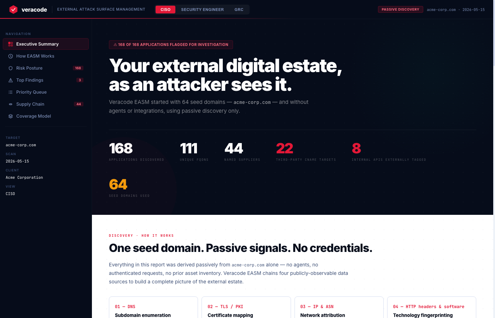
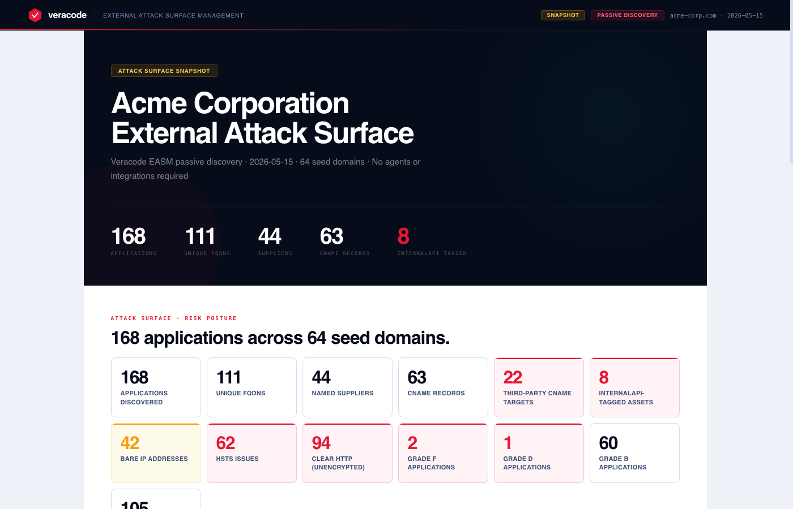

# Veracode EASM Report Generator

> Turn a Veracode EASM xlsx export into a polished report in one command.
> No API keys. No agents. No manual steps.

[](https://python.org)
[](https://weasyprint.org)
[](https://jinja.palletsprojects.com)

---

## What it produces

| Mode | Flag | Description |
|------|------|-------------|
| **Full report** | _(default)_ | Three-view HTML report — CISO executive summary, Security Engineer asset detail, GRC supplier register + remediation plan |
| **Snapshot** | `--teaser` | Single-page preview with headline stats, top findings, and supply chain exposure — designed to share before delivering the full report |
| **PDF** | `--pdf` | Print-ready PDF of either mode, rendered via WeasyPrint |

---

## Screenshots

### Full report — CISO view



### Snapshot (teaser) report



---

## Install

Requires [pipx](https://pipx.pypa.io) — handles the Python environment so you don't need to manage a virtualenv.

**macOS:**
```bash
brew install pipx
git clone <repo>
cd easm-parser
pipx install -e .
```

**Linux / Windows:**
```bash
pip install pipx
git clone <repo>
cd easm-parser
pipx install -e .
```

`easm-report` is now on your PATH.

### PDF support (optional)

PDF output requires WeasyPrint and a system library. Install once:

**macOS:**
```bash
brew install pango
pipx inject easm-report weasyprint
```

**Linux (Debian/Ubuntu):**
```bash
sudo apt-get install -y libpango-1.0-0 libpangoft2-1.0-0 libharfbuzz0b
pipx inject easm-report weasyprint
```

---

## Usage

Drop your two xlsx exports into `inputs/`, then run:

```bash
easm-report --customer "Acme Corp"
# → outputs/acme-corp/acme-corp-veracode-easm-report.html

easm-report --customer "Acme Corp" --pdf
# → outputs/acme-corp/acme-corp-veracode-easm-report.html
# → outputs/acme-corp/acme-corp-veracode-easm-report.pdf

easm-report --customer "Acme Corp" --teaser
# → outputs/acme-corp/acme-corp-veracode-easm-teaser.html

easm-report --customer "Acme Corp" --teaser --pdf
# → outputs/acme-corp/acme-corp-veracode-easm-teaser.html
# → outputs/acme-corp/acme-corp-veracode-easm-teaser.pdf
```

The tool auto-detects the xlsx files by filename pattern:
- `*easm-extract*` — the EASM application export
- `*domain-things*` — the domain register

If multiple matches or no match is found, it tells you clearly. It never silently uses the wrong file.

---

## Options

```
--customer     Customer name — used in report header and output folder  [required]
--input-dir    Folder containing xlsx files  [default: inputs]
--output-dir   Parent folder for output; a subfolder named after the customer is created inside  [default: outputs]
--teaser       Generate a single-page snapshot instead of the full report
--pdf          Also generate a PDF (requires WeasyPrint — see Install)
--verbose      Debug logging
```

---

## What's in each report

### Full report

Three views rendered into a single self-contained HTML file:

- **CISO** — Attack surface posture, top findings, supply chain risk, discovery methodology
- **Security Engineer** — Full asset inventory, CNAME chain analysis, internal API exposure, bare IP inventory
- **GRC** — PII/PCI/AI supplier classification, governance findings, prioritised remediation action plan

### Snapshot report

A single-page preview designed to share with a prospect or stakeholder before the full report is delivered:

- **Hero stats** — Applications, Unique FQDNs, Suppliers, CNAME records, internalApi-tagged assets
- **Attack surface grid** — All key metrics with red/amber highlights (third-party CNAME targets, bare IPs, HSTS issues, grade F/D/B/A counts)
- **Grade distribution** — Risk grade bar chart across all discovered assets
- **Spotlight finding** — The highest-priority finding selected by attacker scoring (see below)
- **Top 3 findings** — Three most attacker-relevant findings in full finding-card format
- **Top 5 suppliers** — Proximity bar chart with PII/PCI/AI classification counts
- **Call to action** — Contact prompt for the full report

All figures come directly from the xlsx data — nothing is invented or estimated.

---

## Finding prioritisation

All findings — in both the full report and the snapshot — are sorted by an attacker-relevance score computed from the scan data. The scoring logic is in `src/easm_report/findings.py:attacker_score()`.

**Signals, in descending weight:**

| Signal | Points | Rationale |
|--------|--------|-----------|
| Cleartext HTTP (`clearHttp` tag) | +60 | Credentials and session tokens traverse the network in plaintext |
| Status `online` | +50 | Endpoint actively responds — no bypass needed to interact with it |
| `internalApi` tag | +25 | Service designed for internal use, exposed on a public address |
| Auth/admin hostname (`auth`, `login`, `oauth`, `sso`, `token`, `admin`) | +25 | Session hijack or privilege escalation surface |
| Developer tooling hostname (`sandbox`, `developer.`, `devlake`, `netbox`, `netsuite`, `fulfil`) | +20 | High recon value; tooling often carries credentials or internal topology |
| Category: staging | +20 | Dev/QA/sandbox environments — reduced controls, data that mirrors production |
| `fc_class` crit | +20 | Worst observed risk grade in the Veracode EASM grading model |
| Category: internal API | +18 | Internal API surface class |
| Non-standard port (8080, 8443, 8000, 8888) on bare IP | +15 | Unmanaged or shadow services |
| Category: CNAME | +15 | External CNAME chain — potential for hijack or misdirection |
| `hostnameCertificateMismatch` tag | +12 | TLS identity cannot be verified |
| `fc_class` d-lvl | +12 | Grade D in Veracode grading |
| Online asset with external CNAME | +10 | Confirms the live endpoint routes through infrastructure outside the seed domains |
| Status `forbidden` | +8 | Exists and responds, gated by 403 |
| Category: hygiene | +8 | Configuration issues |
| `fc_class` med | +5 | Grade B in Veracode grading |

The top-scored finding is used as the **spotlight finding** in the snapshot report. The full report lists all findings in the same order.

---

## Input files

Both files are standard Veracode EASM exports:

| File | Sheets used |
|------|-------------|
| `*easm-extract*.xlsx` | `application`, `supplyChain`, `supplyChainPii`, `supplyChainPci`, `supplyChainAi` |
| `*domain-things*.xlsx` | Domain register — NS, DMARC, DKIM, registrar data |

Drop them into `inputs/` before running. Both are gitignored — customer data never lands in version control.

---

## How it works

```
xlsx files → parser.py → findings.py → renderer.py → validator.py → HTML/PDF
```

**`parser.py`** reads the `application`, `supplyChain*`, and `domain-things` sheets. Every number in the report — apps, grade distribution, tag counts, CNAME count, clear HTTP — comes straight from the xlsx. Seed domains are pulled from the `relatedDomain` column, filtered to entries with ≥2 unique app names to drop the single-app duplicates Veracode auto-appends.

**`findings.py`** runs 8 detection rules: cleartext HTTP, external CNAME chains, resolvable staging/dev/sandbox environments, externally reachable `internalApi`-tagged assets, missing HSTS on auth endpoints, bare IPs on non-standard ports, certificate hostname mismatches, and mixed CA usage. All findings are sorted by `attacker_score()` — a weighted function that surfaces the most actionable issues first. Cleartext HTTP and online status score highest; forbidden-only assets and supplier findings score lowest.

**`renderer.py`** pre-computes everything before passing it to Jinja2, so templates stay as dumb as possible — loops and conditionals only. The snapshot's spotlight section is built by `_researcher_pick()`, which takes the top-scored finding and writes the text from its actual field values. No hardcoding; it adapts to whatever dataset you feed it.

**`validator.py`** checks the rendered HTML before anything hits disk. Severity labels, regulatory framework names, invented risk language, or bleed from a previous customer run all raise a `ValidationError` and abort the write.

**Templates** — `base.html` is the shell (CSS, JS, navigation), with `ciso.html`, `se.html`, and `grc.html` included into it. `teaser.html` is a self-contained single-page snapshot.

---

## LLM tip

Once the report is generated, load the HTML into an LLM (Claude, ChatGPT, etc.) for a second pass — pattern analysis across findings, remediation prioritisation, or an executive narrative layer that goes beyond what the static report surfaces on its own.
